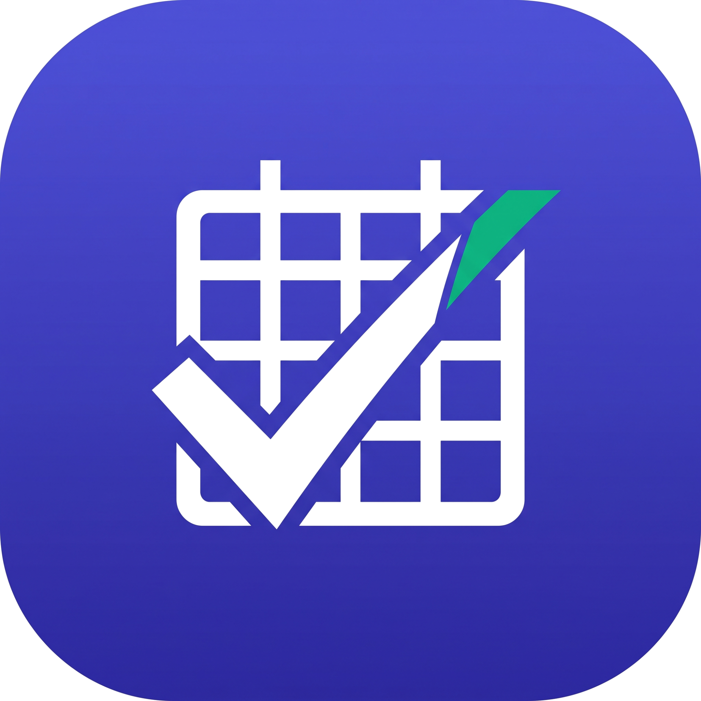

  

  # 📅 Leave Management App

  A modern and efficient application for managing employee leaves and absences smoothly.

  

## 📖 Overview

The **Leave Management App** provides an intuitive interface for employees to request time off and for managers to review and approve leave requests efficiently.

## ✨ Key Features

- **🏢 Multi-Tenant Architecture:** Supports multiple organizations (schools) with complete database-level data isolation.
- **🔐 Role-Based Access Control:** Distinct workflows for `employee`, `manager`, `school_admin`, and `super_admin`.
- **📅 Leave Workflows:** Easy leave application, team calendars, approval management, and reporting.
- **📊 Cross-Platform Dashboard:** Super-admins get a bird's-eye view of all organizations.
- **🛠️ Tech Stack:** Built with Flutter, Firebase, Riverpod, and structured following Clean Architecture principles.

For full setup instructions, project architecture, and implementation details, please see [setup.md](setup.md).

## 👥 Contributors

- [@sajithcode](https://github.com/sajithcode)
- [@buddhima-avishka](https://github.com/buddhima-avishka)
- [@Hirucodes](https://github.com/Hirucodes)
- [@kkindu12](https://github.com/kkindu12)
- [@navi20021234](https://github.com/navi20021234)
- [@SWKHansala](https://github.com/SWKHansala)
